## Дарова!

Меня зовут Савва, я программист из России. Мой псевдоним - SvZ_Code. Старый ник - ArduCat.  

📚 Пишу на: C, C++, Dlang, Python  
📖 Учу: FASM, Kotlin  

Однако я не только программист, я еще и волшебник, работающий с Arch и Alpine Linux :D  

**Я сижу здесь:**  
Telegram канал: https://t.me/svz_code  
 
## Статистика:

!! Статистика может быть слегка outdated !!
