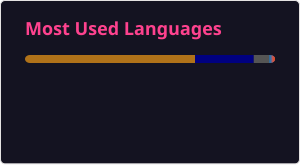

## Дарова!

Меня зовут Савва, я программист из России. Мой псевдоним - SvZ_Code. Старый ник - ArduCat.  
  
В основном пишу на C, C++, Kotlin. Побольше обо мне есть на моем сайте: https://svz-code.github.io/ 
 
## Статистика:

!! Статистика может быть слегка outdated !!
